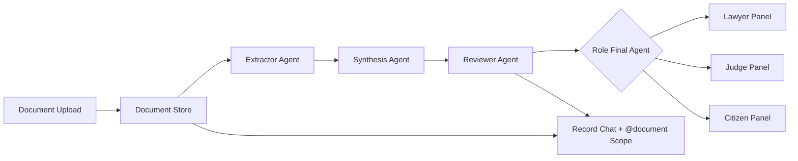

# NyaySetu

NyaySetu is an agentic legal-document workspace for Indian justice workflows. It combines a premium Next.js interface with a FastAPI backend that ingests uploaded case records, extracts source-grounded facts, synthesizes role-specific reports, and answers questions for citizens, lawyers, and judges.

The project is built for Track C: Intelligent Document Synthesis and Analysis Agent. It includes an Extractor Agent, Synthesis Agent, Reviewer Agent, and role-specific final agents for lawyer, judge, and citizen panels.

## What It Does

- Upload PDFs, DOCX files, text files, spreadsheets, images, emails, and scans.
- Store source documents as immutable document versions.
- Extract evidence atoms with page/block provenance.
- Synthesize reports from extracted evidence, relationships, timelines, caveats, and review items.
- Run an integrity reviewer so claims stay tied to source spans.
- Ask questions over all documents or scope a query to one document with `@document-name`.
- Show the live pipeline on the frontend: document store, extractor, synthesis, reviewer, and final answer agent.
- Serve different experiences for lawyer, judge, and citizen users.

## Architecture



## Tech Stack

| Layer | Stack |
| --- | --- |
| Frontend | Next.js App Router, TypeScript, NextAuth, Drizzle, Neon, custom CSS modules |
| Backend | FastAPI, Pydantic, asyncpg, LangGraph-oriented agents |
| Document intelligence | pypdf, PyMuPDF, python-docx, openpyxl, pytesseract, provenance-aware IR |
| AI providers | Gemini, Groq, Anthropic fallback router |
| Database | Neon PostgreSQL |
| Deployment | Vercel-compatible frontend, Docker backend for Hugging Face Spaces |

## Repository Layout

```text
nyaysetu/
  frontend/    Next.js app, auth, role panels, live pipeline UI
  backend/     FastAPI API, document intelligence pipeline, Docker Space config
  backend/app/document_intelligence/
               ingestion, parsing, extraction, synthesis, integrity, chat, storage
```

## Local Setup

### Backend

```bash
cd backend
python -m venv .venv
.venv\Scripts\activate
pip install -r requirements.txt
copy .env.example .env
uvicorn app.main:app --host 0.0.0.0 --port 8000 --reload
```

Backend health check:

```bash
curl http://localhost:8000/api/health
```

### Frontend

```bash
cd frontend
npm install
copy .env.example .env.local
npm run dev -- -p 3005
```

Frontend runs at `http://localhost:3005` when using the command above.

## Demo Accounts

Demo sign-in is supported from the login page. The temporary password is `password123`.

| Role | Email |
| --- | --- |
| Lawyer | `lawyer@nyaysetu.demo` |
| Judge | `judge@nyaysetu.demo` |
| Citizen | `citizen@nyaysetu.demo` |

## Required Environment

Never commit real `.env` files. Use the examples in `frontend/.env.example` and `backend/.env.example`.

Minimum backend secrets:

- `DATABASE_URL`
- `JWT_SECRET`
- At least one model key: `GEMINI_API_KEY`, `GROQ_API_KEY`, or `ANTHROPIC_API_KEY`

Minimum frontend secrets:

- `NEXTAUTH_SECRET`
- `BACKEND_JWT_SECRET` matching backend `JWT_SECRET`
- `DATABASE_URL`
- `NEXT_PUBLIC_BACKEND_URL`
- `PYTHON_BACKEND_URL`

## Deployment

### Backend on Hugging Face Spaces

The backend folder is Docker-ready for Hugging Face Spaces. The Space should use the files inside `backend/` as the repo root.

Required Space settings:

- SDK: Docker
- Port: `7860`
- Secrets: values from `backend/.env.example`

The local document store `backend/data/document-intelligence/` is intentionally ignored and should not be pushed.

### Full App on GitHub

GitHub receives the full monorepo: frontend, backend, schema, tests, and docs. Generated files, local uploads, virtual environments, and `.env` files are ignored.

## Track C Fit

NyaySetu is eligible for Track C because it has:

- An Extractor Agent that transforms unstructured legal documents into source-grounded evidence atoms.
- A Synthesis Agent that compiles extracted data into structured business/legal reports.
- A Reviewer Agent that checks provenance, weak points, caveats, and data integrity.
- Scalable multi-format ingestion and a consistent role-specific final-answer layer.

## Safety Note

NyaySetu gives evidence-grounded legal assistance, not legal advice or a judicial finding. Every generated answer should be reviewed before filing, relying on, or submitting it.